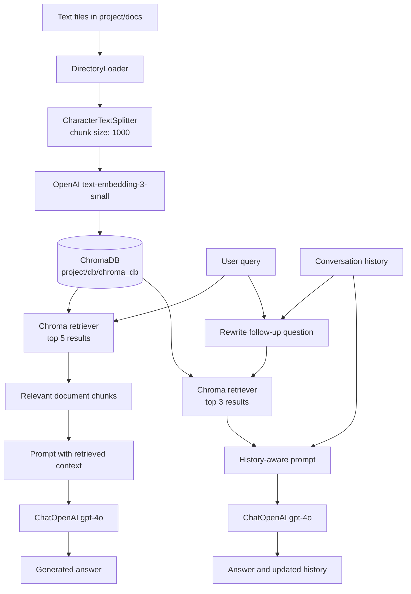

# Retrieval-Augmented Generation (RAG) Demo

A small RAG project that indexes company reference documents, retrieves the
most relevant text for a natural-language question, and uses an OpenAI chat
model to generate answers from that context. It also includes a history-aware
conversation mode that rewrites follow-up questions before searching.

## Project Flow



## Repository Layout

```text
Rag/
├── README.md
└── project/
	├── 1_ingestion_pipeline.py
	├── 2_retreival_pipeline.py
	├── 3_answer_generation.py
	├── 4_history_aware_rag_with_generation.py
	├── docs/                 # Source .txt documents
	└── db/chroma_db/         # Persisted Chroma vector store
```

## How It Works

1. `1_ingestion_pipeline.py` loads every `.txt` file from `project/docs/`.
2. Documents are split into chunks of up to 1,000 characters.
3. `text-embedding-3-small` converts each chunk into a vector embedding.
4. ChromaDB stores the embeddings in `project/db/chroma_db/` using cosine similarity.
5. `2_retreival_pipeline.py` loads the persisted store and retrieves the five most relevant chunks for its query.
6. `3_answer_generation.py` adds the retrieved chunks to a prompt and asks `gpt-4o` to produce an answer.
7. `4_history_aware_rag_with_generation.py` uses conversation history to rewrite follow-up questions, retrieves three relevant chunks, generates an answer, and stores the exchange in memory.

The included documents cover Google, Microsoft, Nvidia, SpaceX, and Tesla.

## Setup

Create a `.env` file in `project/` with an OpenAI API key:

```env
OPENAI_API_KEY=your_api_key_here
```

The project dependencies are already present in the included virtual
environment. To use a different environment, install the packages imported by
the scripts, including `langchain-community`, `langchain-text-splitters`,
`langchain-openai`, `langchain-chroma`, and `python-dotenv`.

The generation scripts require access to both the OpenAI embedding model
`text-embedding-3-small` and the chat model `gpt-4o`. API usage may incur costs.

## Run

Run commands from the `project/` directory so the relative paths resolve
correctly:

```powershell
cd project
python 1_ingestion_pipeline.py
python 2_retreival_pipeline.py
python 3_answer_generation.py
python 4_history_aware_rag_with_generation.py
```

The ingestion script skips rebuilding the database when
`db/chroma_db/` already exists. Remove that directory before rerunning
ingestion if the source documents have changed.

## Example Query

The retrieval script currently searches for:

```text
How much did Microsoft pay to acquire GitHub?
```

It prints the query and the retrieved document chunks as context.

The answer-generation script uses the same query and prints a model-generated
response based only on the retrieved chunks. The history-aware script starts an
interactive session; type `quit` to exit. Its conversation history is kept in
memory for the duration of that process and is not persisted to disk.
